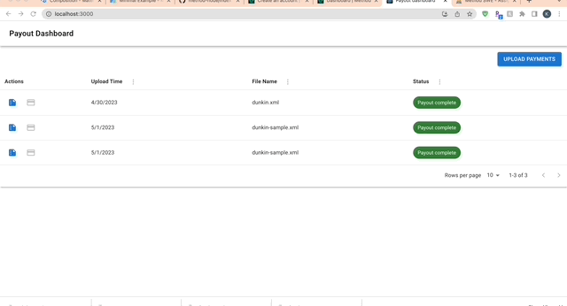
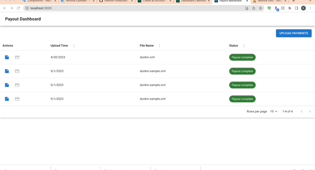

## Overview
This is a full stack app built using the [MERN](https://en.wikipedia.org/wiki/MEAN_(solution_stack)) tech stack. The app provides the functionality to upload xml files, make payouts through [Method](https://methodfi.com/), and generate reports afterwards.

## Local development
### Pre-requisites
1. Open a tunnel on port 5001 (backend) through a service like https://ngrok.com/ . This enables callback through webhooks
2. Locate `sever/.env` file
    - Replace `METHOD_API_LEY` with your personal dev api key obtained through https://dashboard.methodfi.com/login
    - Replace `METHOD_WEBHOOK_URL` with your tunnel url from step 1
3. Make sure you have docker and docker-compose installed - [installaion guide](https://docs.docker.com/compose/install/)

### Get started
1. Run 
    ```
    docker-compose up
    ```
    - Locate frontend at localhost:3000, backend at localhost:5001, and mongodb at localshot:27017

### Note
We use [Agenda](https://github.com/agenda/agenda) for background job scheduling locally.

## Staging environments

- In staging environments, make sure to replace `METHOD_API_LEY` and `METHOD_WEBHOOK_URL` with staging api keys and urls. 
- Would probably want to use a queuing system like Kafka or SQS to handle async jobs instead of Agenda.
## Demo
### Upload payments

### Reporting


## TODO
- Add email notification when processing files and payouts
- Pagination on api calls
- Retry on errors using dead letter queue or other sorts and surface to user
- Show current progress to users
